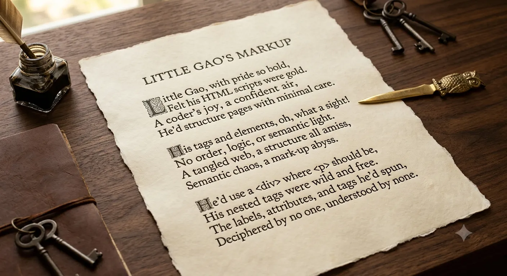

从前有个人叫小高 
他说写 HTML 感觉最好 
但他写的代码结构语义一团糟 
他写的标签谁也懂不了。

<em>
Once there was a man named Xiao Gao, 
Who said writing HTML felt best of all, 
But his code's structure and semantics were a mess, 
And no one could ever understand his tags.
</em>

